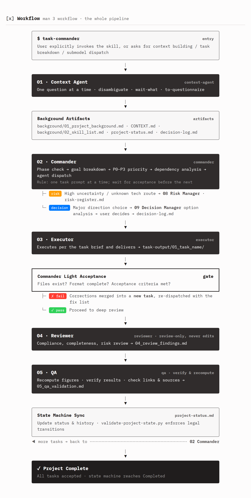

# Task Commander

**Turn one AI coding agent into a disciplined multi-model team.**

Build context before coding. Split work into verifiable tasks. Dispatch execution across chat windows. Review and QA every important delivery. Keep decisions and task state in files, not in your head.

Task Commander is a host-neutral orchestration skill built around a formal task state machine and two zero-dependency Python scripts. No server, no API key, no agent runtime — just a structured protocol you can run across Windows, macOS, and Linux.

## Why this exists

Long AI projects usually fail for reasons that have little to do with the model itself:

- Context gets lost across long conversations and separate chat windows.
- One model ends up planning, implementing, and judging its own work.
- Tasks, decisions, blockers, and acceptance criteria disappear into chat history.
- Multi-agent frameworks often require servers, APIs, orchestration infrastructure, or a fully automated runtime.

Task Commander takes a different approach: **keep the intelligence in the models, but put the process under explicit control.**

## What you get

**A lightweight command center for AI-assisted projects:**

`Context Agent → Commander → Executor → Reviewer / QA → Risk Manager → Decision Manager`



Every task has an explicit owner, scope, dependencies, quality gates, acceptance criteria, and state. The state machine defines what transitions are legal, while the validator script checks the project status instead of trusting the conversation.

The human remains the final decision-maker. Task Commander handles the structure, not the authority.

## Features

- Multi-role collaboration: Context Agent, Commander, Executor, Reviewer, QA, Risk Manager, Decision Manager
- Task state machine: `project-status.md` manages phases, tasks, blockages, and history in one place; the script enforces legal state transitions
- Low-cost skill discovery: skill list generation reading only frontmatter
- Cross-platform core: the runtime principles avoid assumptions about a specific OS, shell, path layout, or CLI; Codex and OpenCode are the currently supported hosts, and skill paths are located by runtime discovery

## Installation

Put this directory into the host's skill search path; the location is resolved at runtime via Runtime Discovery, never hard-coded.

- OpenCode: place this directory in a standard skill directory — a user-level `~/.config/opencode/skills/` or a project-level `.opencode/skills/` (or the equivalent position for your setup); it is discovered automatically.
- Codex: place this directory under `$CODEX_HOME/skills/` (`$CODEX_HOME` defaults to `~/.codex`); it is discovered automatically.

The core protocol is host-neutral. Codex and OpenCode are currently supported hosts; other hosts are not officially adapted. `agents/openai.yaml` is an OpenAI/Codex-specific integration descriptor, not part of the core protocol.

The per-host directories are listed as adaptation examples in the "Known host adaptations (examples for adaptation, not the default protocol)" appendix of `references/12-skill-discovery.md`; `scripts/scan-skills.py` locates them at runtime.

The entry document is `SKILL.md`.

## Optional integrations

The context orchestration flow composes the following external skills; use each if present, otherwise use the built-in fallback `references/methodology-fallback.md` (location and composition order in `references/10-context-orchestration.md`):

- `writing-for-agents`
- `grill-with-docs`
- `wait-what`
- `to-questionnaire`

Optional:

- `skill-creator`: validates this skill's structure (using its own structure and content validation flow)

## Directory structure

- `SKILL.md` — skill entry and mandatory rules
- `references/` — role and workflow guidance
  - `00-overview.md` overview and role table
  - `01-context-brief.md` Context Agent prompt
  - `02-commander.md` Commander prompt
  - `03-executor.md` Executor prompt
  - `04-reviewer.md` Reviewer prompt
  - `05-qa.md` QA validation prompt
  - `06-task-template.md` task prompt template
  - `07-verification-guidelines.md` verification rules
  - `08-risk-manager.md` Risk Manager prompt
  - `09-decision-manager.md` Decision Manager prompt
  - `10-context-orchestration.md` context orchestration protocol
  - `11-task-state-machine.md` task state machine
  - `12-skill-discovery.md` skill discovery protocol
  - `runtime.md` cross-platform host execution principles
  - `methodology-fallback.md` built-in methodology fallback (zero-dependency distillation used when the composed external skills are absent)
- `templates/` — project status, state specification, agent registry, and decision log templates
- `scripts/` — skill scanning and project status validation scripts
  - `scan-skills.py` scans skill candidates by frontmatter
  - `validate-project-state.py` validates `project-status.md` structure and state transitions
- `agents/openai.yaml` — agent configuration
- `assets/workflow-section-en.png` — workflow overview diagram
- `.github/workflows/ci.yml` — three-platform CI matrix
- `.gitattributes` — line-ending and encoding declarations

## Dependencies

- Python 3.10+ (standard library only, zero third-party dependencies). Use the current runtime interpreter when available; otherwise try `py -3` then `python` on Windows, or `python3` then `python` on macOS/Linux, and verify the reported version.
- Codex or OpenCode with skill support (the core protocol is host-neutral; other hosts are not officially adapted)
- Project files use UTF-8 without BOM

## Triggering

- Explicit call of `task-commander` or `$task-commander`
- Requests expressing context building, task breakdown, multi-model collaboration, review, and QA acceptance

## Script self-check

```text
# Validate a project status file (run from the Task Commander root)
<python> scripts/validate-project-state.py --path <path/to/project-status.md>

# Scan skill candidates (reads only frontmatter)
<python> scripts/scan-skills.py --query-terms <query term1> <query term2>
```
